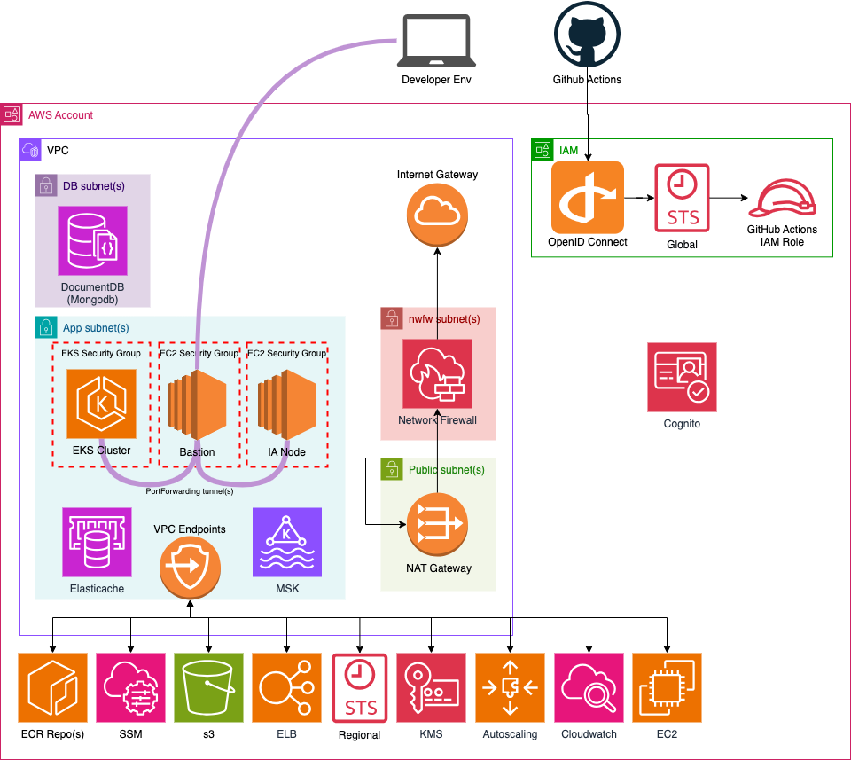
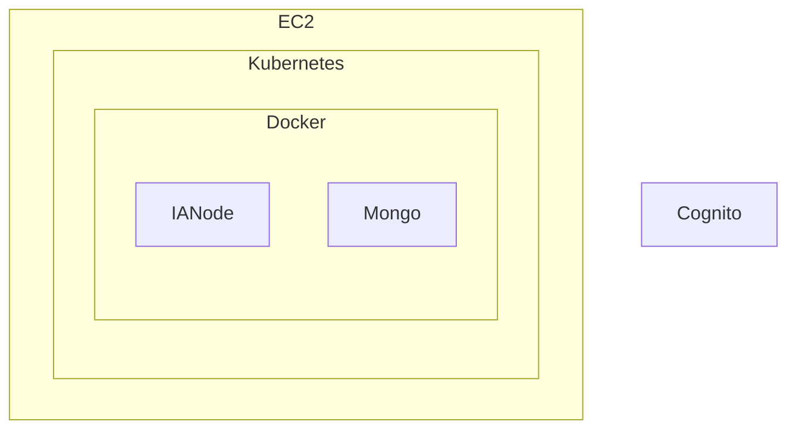

# Deploy to AWS

## Deploying to a EC2 instance
Below are a few options on how to install and run a IANode on a AWS EC2 instance.

### Using Docker
Required Software / Services
* A user authentication service (like Cognito)
* Docker and Docker Compose (to manage the [Secure Agent Graph](https://github.com/National-Digital-Twin/secure-agent-graph) app, [IAnode Access](https://github.com/National-Digital-Twin/ianode-access/) app and the latest MongoDB image)
* Kafka service (which can be a managed service a Docker image)

Optional List
* ECR repository (to manage images on AWS)
* S3 bucket (storage to store configuration files)

The EC2 instance will need to be able to access the user authentication service and a user based JWT token will be to be obtainable from this user authentication service.
This JWT token is used by Secure Agent Graph and IANode access as access control.

Docker images of [Secure Agent Graph](https://github.com/National-Digital-Twin/secure-agent-graph) and [IAnode Access](https://github.com/National-Digital-Twin/ianode-access/) 
will need be to added to the EC2 instance, use the above links for the Secure Agent Graph and IANode Access for more instructions on how to build and config these images. 
Both repositories have instructions on how to configure MongoDb.

An example of a Docker Compose file can be found at [SAG Docker Compose](https://github.com/National-Digital-Twin/secure-agent-graph/blob/pre/docker-compose/docker-compose-github.yaml) 
which can be used a reference when building the docker compose file

Once the docker compose file has been constructed and the relevant files have been added to the EC2 instance
([SAG Docker Compose](https://github.com/National-Digital-Twin/secure-agent-graph/blob/pre/docker-compose/docker-compose-github.yaml)
for a list of relevant files required)

use the following command to start the services in the background

```
docker-compose up -d
```

For testing, reference [Access Control Tests](DeploymentLocal.md#run-access-control-test) for curl commands to test, there is a file called [data1.trig](https://github.com/National-Digital-Twin/secure-agent-graph/blob/pre/sag-docker/Test/data1.trig) 
which will need to be uploaded to the instance

### Using Java and Git
Another option is to treat it like another development machine and use [DeploymentLocal.md](DeploymentLocal.md) to install and test.

### Terraform
Terraform can be used to set up the AWS testing environment with a ECR repository within AWS, 
reference the [Cloud PlatForm Readme](../../CloudPlatform/AWS/README.md) for more details of how this can be done

Critical Path Design



### GitHub actions and EC2 instance
Once these AWS services have been installed, Github Actions can be setup to manage the environment where the following tasks
can be managed
* Send commands to a EC2 instance
* Push tagged images to the ECR
* Pull docker images to the EC2 instance
* run docker compose on the EC2 instance
* Open Tunnel via Bastion to the Ec2 instance, this is useful for testing out the AWS instance locally

For more details see [AWS Integration Testing](https://github.com/National-Digital-Twin/aws-integration-testing)


## Deploying to Kubernetes


