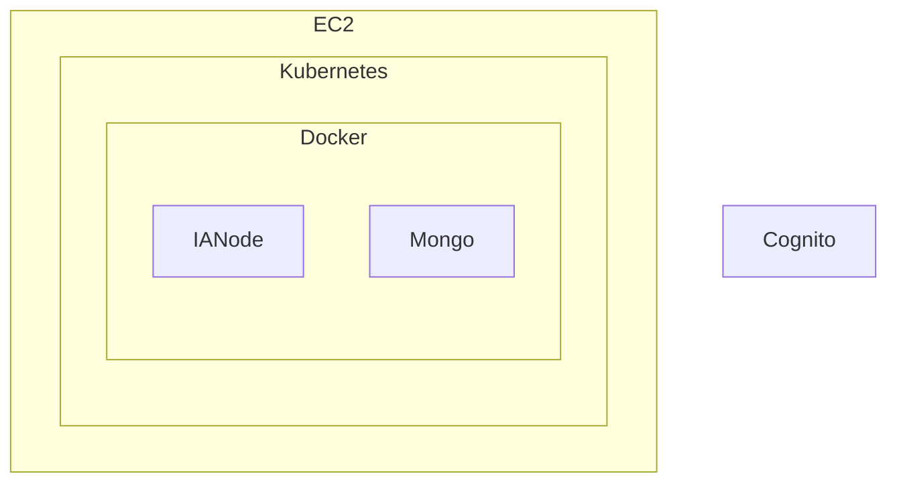

# Deploying to AWS
**Repository:** integration-architecture-documentation 

**Description:** This file provides documentation on how to deploy an IA node to an AWS EC2 instance and Kubernetes. 

<!-- SPDX-License-Identifier: OGL-UK-3.0 -->

You can build and deploy an IA node to an AWS cloud platform including an EC2 instance and Kubernetes as one of the cloud platform options. Outline below is how to do it.

## Deploying to a EC2 instance
There are a few options on how to install and run an IA node on a AWS EC2 instance.

### Using Docker
Required Software / Services
* A user authentication service (like Cognito)
* Docker and Docker Compose (to manage the [Secure Agent Graph](https://github.com/National-Digital-Twin/secure-agent-graph) app, [IA Node Access](https://github.com/National-Digital-Twin/ianode-access/) app and the latest MongoDB image)
* Kafka service (which can be a managed service a Docker image)

Optional List
* ECR repository (to manage images on AWS)
* S3 bucket (storage to store configuration files)

The EC2 instance will need to be able to access the user authentication service and a user based JWT token will be to be obtainable from this user authentication service.
This JWT token is used by Secure Agent Graph and IANode access as access control.

Docker images of [Secure Agent Graph](https://github.com/National-Digital-Twin/secure-agent-graph) and [IA Node Access](https://github.com/National-Digital-Twin/ianode-access/) 
will need be to added to the EC2 instance, use the above links for the Secure Agent Graph and IA Node Access for more instructions on how to build and config these images. 
Both repositories have instructions on how to configure MongoDb.

An example of a Docker Compose file can be found at [SAG Docker Compose](https://github.com/National-Digital-Twin/secure-agent-graph/blob/pre/docker-compose/docker-compose-github.yaml) 
which can be used a reference when building the docker compose file

Once the docker compose file has been constructed and the relevant files have been added to the EC2 instance
([SAG Docker Compose](https://github.com/National-Digital-Twin/secure-agent-graph/blob/pre/docker-compose/docker-compose-github.yaml)
for a list of relevant files required)

use the following command to start the services in the background

```
docker-compose up -d
```

For testing, reference [Access Control Tests](DeploymentLocal.md#run-access-control-test) for curl commands to test, there is a file called [data1.trig](https://github.com/National-Digital-Twin/secure-agent-graph/blob/pre/sag-docker/Test/data1.trig) 
which will need to be uploaded to the instance

### Using Java and Git
Another option is to treat it like another development machine and use [deploying locally](deployment-local.md) to install and test.

### Terraform
Terraform can be used to set up the AWS testing environment with a ECR repository within AWS, 
reference the [Cloud PlatForm Readme](../../CloudPlatform/AWS/README.md) for more details of how this can be done


### GitHub actions and EC2 instance
Once these AWS services have been installed, Github Actions can be setup to manage the environment where the following tasks
can be managed
* Send commands to a EC2 instance
* Push tagged images to the ECR
* Pull docker images to the EC2 instance
* run docker compose on the EC2 instance
* Open Tunnel via Bastion to the EC2 instance, this is useful for testing out the AWS instance locally

For more details see [AWS Integration Testing](https://github.com/National-Digital-Twin/aws-integration-testing)

## Amazon Managed Service Amazon (MSK)
Amazon Managed Streaming for Kafka (MSK) is a fully managed service that simplifies building and running applications that use Apache Kafka to process streaming data.

A good tutorial on using Amazon MSK can be found on [Getting Started with Amazon MSK](https://docs.aws.amazon.com/msk/latest/developerguide/getting-started.html), this tutorial
works through
* Provisioning an MSK cluster
* IAM roles
* Creating topics
* Producing and Consuming data

### IAM Role Policy
Its important that the IAM role policy allows access to create topics on the MSK cluster and permissions to send
(produce) / receive (consume) data from these topics

Below is a copy of the IAM policy used within ndtp-testing
```
{
            "Action": [
                "kafka:List*",
                "kafka:Describe*",
                "kafka-cluster:WriteDataIdempotently",
                "kafka-cluster:Describe*",
                "kafka-cluster:Connect",
                "kafka-cluster:AlterCluster"
            ],
            "Effect": "Allow",
            "Resource": "arn:aws:kafka:eu-west-2:127214183387:cluster/ndtp-testing/706c2ca0-e358-4abe-8782-ebed09379083-4",
            "Sid": "MSKClusterAccess"
        },
        {
            "Action": [
                "kafka-cluster:WriteData",
                "kafka-cluster:ReadData",
                "kafka-cluster:*Topic*"
            ],
            "Effect": "Allow",
            "Resource": "arn:aws:kafka:eu-west-2:127214183387:topic/ndtp-testing/706c2ca0-e358-4abe-8782-ebed09379083-4/*",
            "Sid": "MSKTopicAccess"
        },
        {
            "Action": "kafka-cluster:*Group*",
            "Effect": "Allow",
            "Resource": "arn:aws:kafka:eu-west-2:127214183387:group/ndtp-testing/706c2ca0-e358-4abe-8782-ebed09379083-4/*",
            "Sid": "MSKGroupAccess"
        },
        {
            "Action": "kafka-cluster:*TransactionalId*",
            "Effect": "Allow",
            "Resource": "arn:aws:kafka:eu-west-2:127214183387:transactional-id/ndtp-testing/706c2ca0-e358-4abe-8782-ebed09379083-4/*",
            "Sid": "MSKTransactionalIdAccess"
        },
```

### Kafka CLI tool
The Kafka CLI tool can be used to interact with a Kafka instances or in this case an AWS MSK cluster, more information
regarding requirements to connect to the AWS MSK cluster can be found [AWS and Kafka CLI tool](https://docs.aws.amazon.com/msk/latest/developerguide/create-topic.html)  
The link above walkthrough downloading and installing the Kafka CLI tool.

Access to AWS MKS is restricted to within the same VPC, meaning no outside access to MSK is granted,
therefore the CLI tool mentioned will need to be installed on an EC2 instance within the same VPC where the IAM policy mentioned
in [IAM Role Policy](#iam-role-policy) is added to a role associated with the EC2 instance.

If there are any difficulties downloading packages on the EC2 instance, best option would be to download it on your local
machine and push it up into S3
```
aws s3 cp aws-msk-iam-auth-2.3.0-all.jar s3://ia-node-config/
```

Then SSh into the EC2 instance and download it from S3
```
aws s3 cp s3://ia-node-config/aws-msk-iam-auth-2.3.0-all.jar .
```

### Environment Variables for Kafka CLI commands
The following Environment variables will be used for a number of Kafka CLI commands below, where authentication is done via IAM

```
#Environment variables 
MSK_BOOTSTRAP = Endpoint for MSK Cluster  
MSK_CLIENT_PROPS = AWS IAM properties files
```
MSK client properties for AWS IAM (MSK_CLIENT_PROPS)
```
security.protocol=SASL_SSL
sasl.mechanism=AWS_MSK_IAM
sasl.jaas.config=software.amazon.msk.auth.iam.IAMLoginModule required;
sasl.client.callback.handler.class=software.amazon.msk.auth.iam.IAMClientCallbackHandler

```
### Kafka Topics

#### Create Topic
This command creates a topic called <b>RDF</b> within the MSK Cluster

```
kafka_2.13-3.7.2/bin/kafka-topics.sh --create \
--bootstrap-server $MSK_BOOTSTRAP \
--command-config $MSK_CLIENT_PROPS \
--replication-factor 3 --partitions 1 \
--topic RDF
```

#### Delete Topic
This command deletes a topic called <b>RDF</b> within the MSK Cluster

```
 kafka_2.13-3.7.2/bin/kafka-topics.sh --delete \
 --bootstrap-server $MSK_BOOTSTRAP \
 --command-config $MSK_CLIENT_PROPS  \
 --topic RDF
```

### Producing and Consuming Data
A producer is an agent that adds data to a Kafka topic and a consumer is an agent that pulls data from a Kafka Topic

#### Producer
As Kafka topics treat each new line encountered as the end of an entry, new lines had to be stripped from the data file.

To ensure Secure Agent Graph understood what is was consuming, a content type had to be added to the start of the file
to allow correct processing  
An example of a new line stripped data file can be found at [data1-no-new-lines](https://github.com/National-Digital-Twin/secure-agent-graph/blob/pre/sag-docker/Test/data1-no-new-lines.trig)

the command below sends the data1-no-new-lines.trig file to the RDF topic which gets treated
as one entry
```
kafka_2.13-3.7.2/bin/kafka-console-producer.sh --broker-list $MSK_BOOTSTRAP  \
--producer.config $MSK_CLIENT_PROPS \
--topic RDF \
--property "parse.headers=true" \
--property "headers.key.separator=:" \
--property "headers.delimiter=\t" \
< data1-no-new-lines.trig
```
#### Consumer
The following command pull back all the entries within RDF Topic (from-beginning).
```
kafka_2.13-3.7.2/bin/kafka-console-consumer.sh \
--bootstrap-server $MSK_BOOTSTRAP \
--consumer.config $MSK_CLIENT_PROPS \
--topic RDF --from-beginning
```

### Secure Agent Graph and AWS MSK via AWS IAM roles
The Secure Agent Graph can integrate with AWS MSK via a ttl file. An example of this can be found on [aws-server-kafka.ttl](https://github.com/National-Digital-Twin/secure-agent-graph/blob/pre/sag-docker/mnt/config/aws-server-kafka.ttl) 
where the critical parts of the ttl file is under fk:Connector section

```
[] rdf:type fk:Connector ;
fk:configFile         "config/aws-kafka.properties";
fk:bootstrapServers   "env:{MSK_BOOTSTRAP:localhost:9098}";
fk:topic              "RDF";
```

* fk:configFile points - to a set of properties headers that are set with each call
* fk:bootstrapServers - points to the endpoints for the Kafka service on Amazon
* fk:topic -  topic the Secure Agent graph will act as a consumer against

Secure Agent Graph is deployed via a Docker Image [Secure Agent Graph docker-compose](https://github.com/National-Digital-Twin/secure-agent-graph/blob/pre/docker-compose/docker-compose-github.yaml)
where at the bottom of the secure-agent-graph-container section, it points to a ttl file on startup

```
  secure-agent-graph-container:
    pull_policy: always
    image: 127214183387.dkr.ecr.eu-west-2.amazonaws.com/secure-agent-graph:latest
    container_name: secure-agent-graph-container
    networks:
      - type: bind
        source: ../sag-docker/mnt/config
        target: /fuseki/config
    command: "--config config/aws-server-kafka.ttl"
```

## Kubernetes
### Deploying to Kubernetes
Deployment to Kubernetes is handled using Kustomize. The workflow for deployment is detailed within [deploy-to-kube-kustomize.yml](https://github.com/National-Digital-Twin/integration-architecture/blob/main/.github/workflows/README.md#deploy-to-kube-kustomizeyml)



### Updates to Services on Kubernetes
Once the Kubernetes cluster is setup, any updates for the installed services can be done via the [Overlay/Testing](https://github.com/National-Digital-Twin/integration-architecture/tree/main/CICD/kustomize/overlay/testing) folder,
the idea behind this is that any service specific updates can be patched in without affecting the underlying Kubernetes cluster.


### Kubernetes and AWS MSK via IAM Roles
Setting up AWS MSK on Kubernetes, follows the same process as [Secure Agent Graph and AWS MSK via Amazon IAM roles](#secure-agent-graph-and-aws-msk-via-aws-iam-roles)
the only difference is these files need to be saved within the [secure-agent-graph config](https://github.com/National-Digital-Twin/integration-architecture/tree/main/CICD/kustomize/overlay/testing/secure-agent-graph/server/patches/config) folder 
of the Overlay/Testing section mentioned in [Updates to Services on Kubernetes](#updates-to-services-on-kubernetes) above

### Pushing updates to AWS via Github Workflows
A Github workflow can be used to push up changes made within Kubernetes, where different services as well as Git 
branches can be selected [Kubernetes workflow](https://github.com/National-Digital-Twin/integration-architecture/actions/workflows/Deploy-to-kube-kustomize.yml)

### Connecting to AWS Kubernetes cluster locally
As the Kubernetes cluster is locked down, a tunnel will need to be established to allow access to the cluster, a [tunneling guide](https://github.com/National-Digital-Twin/integration-architecture/blob/main/CloudPlatform/AWS/docs/eks-tunnelling.md)
has been put together by the Ops team, follow the instructions in the link above to establish a tunnel

#### Download Kubectl
[Download Kubectl](https://kubernetes.io/docs/tasks/tools/) from the Kubernetes site or if you are on a Mac and use homebrew, you can also use the [Kubectl Homebrew](https://formulae.brew.sh/formula/kubernetes-cli) link

#### Kubectl Commands
This section assumes you have a tunnel connected via ssm start-session command see [Connecting to Kubernetes locally](#connecting-to-kubernetes-locally).

###### Get Pods
pulls back all running pods and provides a status of each pod

```
#get Pods
kubectl get pods -n ndtp-testing

NAME                                READY   STATUS              RESTARTS   AGE
federator-client-64f968bffb-jptfd   1/1     Running             0          18m
federator-server-764d5d7c88-7fpcz   1/1     Running             0          18h
ianode-access-78d959bfcb-zz89k      0/1     ContainerCreating   0          109m
secure-agent-graph-server-0         1/1     Running             0          8h
```
###### Logs
pulls back logs of pod by name (names are obtained by running get pods) 
```
kubectl logs ianode-access-78d959bfcb-zz89k -n ndtp-testing

Error from server (BadRequest): container "ianode-access" in pod "ianode-access-78d959bfcb-zz89k" is waiting to start: ContainerCreating
```

###### SSH into container
Depending on the underlying image within the container you may be able to ssh into, again the name of the pod is obtained by running get pods

```
kubectl exec --stdin --tty secure-agent-graph-server-0  -n ndtp-testing -- /bin/bash

fuseki@secure-agent-graph-server-0:/fuseki$ ls -la
total 32
drwxr-xr-x. 1 fuseki root      20 Mar 18 03:16 .
drwxr-xr-x. 1 root   root      42 Mar 18 03:16 ..
drwxr-xr-x. 1 fuseki root      41 Mar 13 16:44 agents
drwxrwsrwt. 3 root   fuseki   140 Mar 18 03:15 config
drwxrwsr-x. 3 root   fuseki  4096 Mar 18 03:16 databases
-rwxr-xr-x. 1 fuseki root     692 Mar 13 16:44 entrypoint.sh
drwxrwsr-x. 3 root   fuseki  4096 Mar 17 16:45 labels
drwxr-xr-x. 1 fuseki root   16384 Mar 13 16:44 lib
-rw-r--r--. 1 fuseki root    2164 Mar 13 16:44 logback.xml
drwxr-xr-x. 2 fuseki root       6 Mar 13 16:45 logs
fuseki@secure-agent-graph-server-0:/fuseki$ 
```

###### Port Forwarding 
Useful for local testing as all traffic and calls on the forwarded port goes to Kubernetes pod
```
kubectl port-forward secure-agent-graph-server-0 3030:3030 -n ndtp-testing
 
Forwarding from 127.0.0.1:3030 -> 3030
Forwarding from [::1]:3030 -> 3030

```
now all http requests to port 3030 will be handled by secure-agent-graph-server-0


© Crown Copyright 2025. This work has been developed by the National Digital Twin Programme and is legally attributed to the Department for Business and Trade (UK) as the governing entity.  
Licensed under the Open Government Licence v3.0.  

You can view the full license at:  
https://www.nationalarchives.gov.uk/doc/open-government-licence/version/3/
