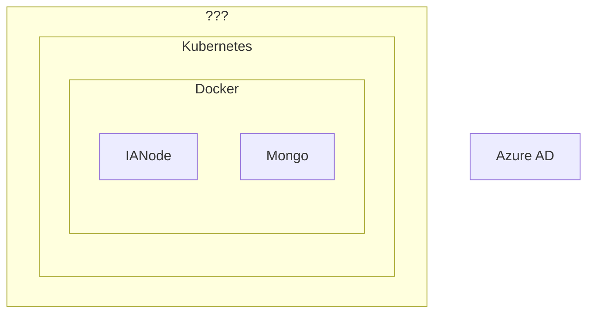

# Deploy to Azure

**Repository:** `integration-architecture-documentation`  
**Description:** `This file provides documentation on how to deploy an Integration Architecture node to Azure AD. `  
<!-- SPDX-License-Identifier: OGL-UK-3.0 -->

You can build and deploy an IA node to an Azure cloud platform including AD. Further details on doing this will be published soon. The diagram below gives you an idea of the deployment configuration: 

© Crown Copyright 2025. This work has been developed by the National Digital Twin Programme and is legally attributed to the Department for Business and Trade (UK) as the governing entity.  
Licensed under the Open Government Licence v3.0.