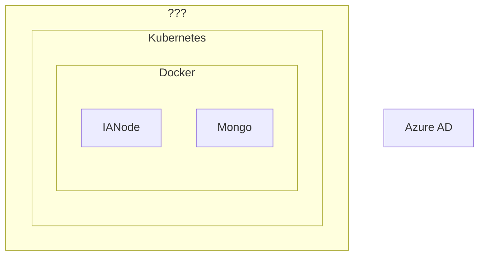

# Deploy to Azure
## Outlines how to deploy an IA node to Azure AD.
You can build and deploy an IA node to an Azure cloud platform including AD. Further details on doing this will be published soon. The diagram below gives you an idea of the deployment configuration: 

