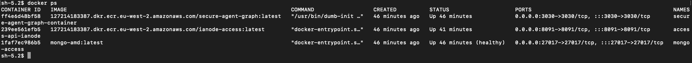
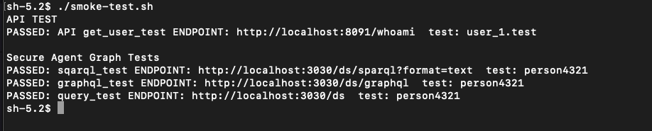
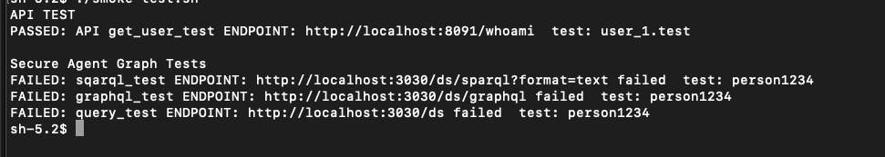

## Pre-requisites

* aws-cli
* AWS Cognito setup with test users 
* Github actions pushes up latest images and starts them

## Log into AWS
The aws group name for the testing group will be required, replace AWSGROUPNAME with your group name and run the aws ec2 describe command below

If an instance-id has already been provided to you for an instance inside the testing group, then you only need the aws ssm start-session command below

```
aws ec2 describe-instances --filters "Name=instance.group-name,Values=AWSGROUPNAME" --query 'Reservations[*].Instances[*].[InstanceId]'
```
Take that id returned and enter
```
aws ssm start-session --target <instance-id>
```

## AWS Smoke Testing
Check that the docker images are running 
```
docker ps
```
Something similar should be shown 


Where mongo, secure-agent-graph and ianode-access are running, if these aren't running use the [ianode-access Workflow](https://github.com/National-Digital-Twin/ianode-access/actions/workflows/build-compose-action.yml) on github to start these containers 

### Adding Smoke tests to AWS instance
There are 2 testing scripts that need to be added to the AWS instance, copy the scripts into S3 then from the testing instance pull down the scripts
 * [smoke-test.sh](../../testing/aws/smoke-test.sh)
 * [aws-congnito-get-token.sh](../../testing/aws/aws-congnito-get-token.sh)

From this repos root
```
cd testing/aws
aws s3 cp  smoke-test.sh s3://(bucket-name)
aws s3 cp aws-congnito-get-token.sh s3://(bucket-name)

```

Then log into the instance and pull those scripts from S3
```
aws s3 cp s3://(bucket-name)/smoke-test.sh .
aws s3 cp s3://(bucket-name)/aws-congnito-get-token.sh .
```
Fix permissions on both scripts
```
chmod +x smoke-test.sh
chmod +x aws_congnito-get-token.sh
```

### Running Tests

The script requires some environment variables to be set before running it, login details for one test user are required to pull the user token from Cognito

The following assumes that the Cognito test user details are
* username: user_1.test
* password: Password1!
* AWS_REGION: eu-west-2

Enter the following commands into the AWS instance terminal
```
export TEST_USER1='user_1.test'
export TEST_USER1_PASSWORD='Password1!'
export AWS_REGION='eu-west-2'

export IANODE_API_URL='http://localhost:8091'
export SECURE_AGENT_GRAPH_URL='http://localhost:3030'
export TEST_DATA_PERSON1='person4321'
```

Now run the tests
```
./smoke-test.sh
```


To fail these tests when doing data comparison, change PERSON1 data to something else and re-run these tests
```
export TEST_DATA_PERSON1='person1234'
./smoke-test.sh
```

