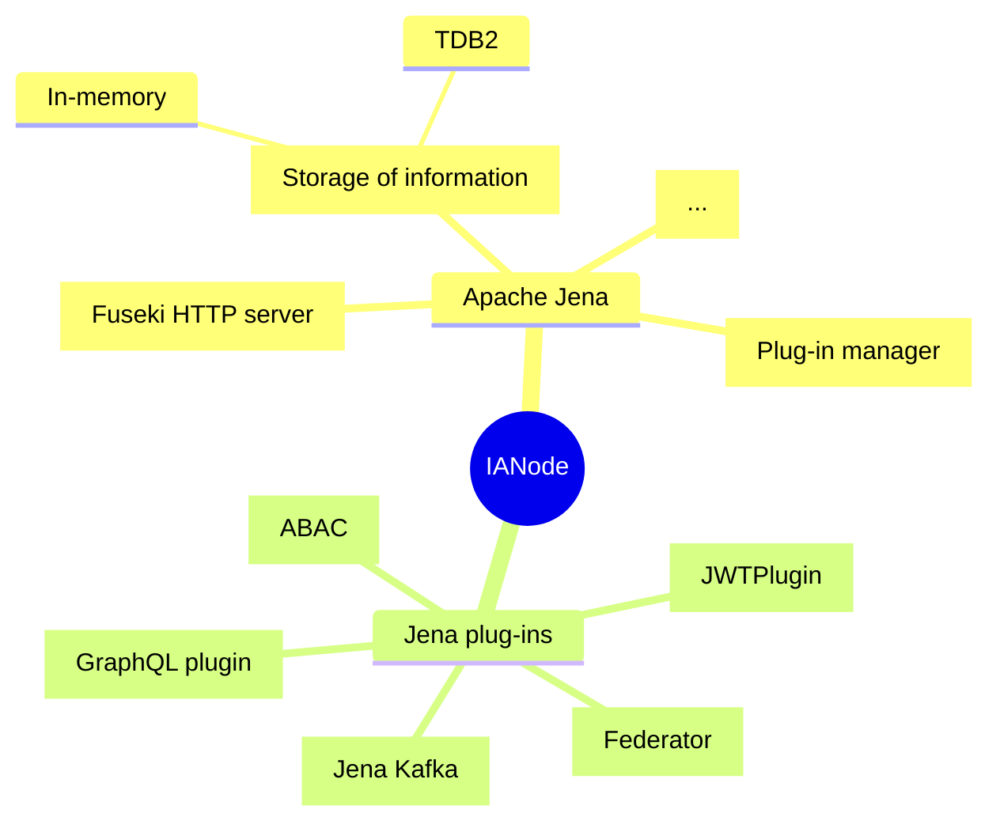
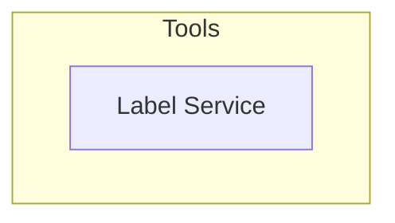

# IANode components

An [IANode](IANode.md) comprises many components built on top of Apache Jena.

```mermaid
mindmap
  root((IANode))
    Apache Jena
      storage[Storage of information]
        In-memory
        TDB2
      fuseki[Fuseki HTTP server]
      plugInManager[Plug-in manager]
      more[...]
    Jena plug-ins
          abac[ABAC]
          jwtPlugin[JWTPlugin]
          graphQLPlugin[GraphQL plugin]
          federator[Federator]
          jenaKafka[Jena Kafka]
```

```mermaid
flowchart TD
  subgraph Tools
    labelService[Label Service]
  end
```
