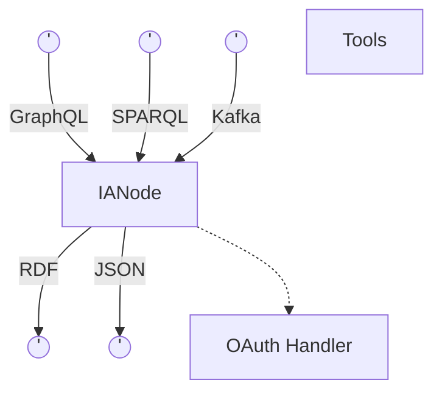

# IANode context
An [IANode](IANode.md) accepts SPARQL and GraphQL queries as well as actions and data via Kafka. The IANode provides Json in response to GraphQL queries and RDF for SPARQL queries. It integrates with an OAuth handler to provide fine-grained access control to information in the IANode or connected IANodes.

