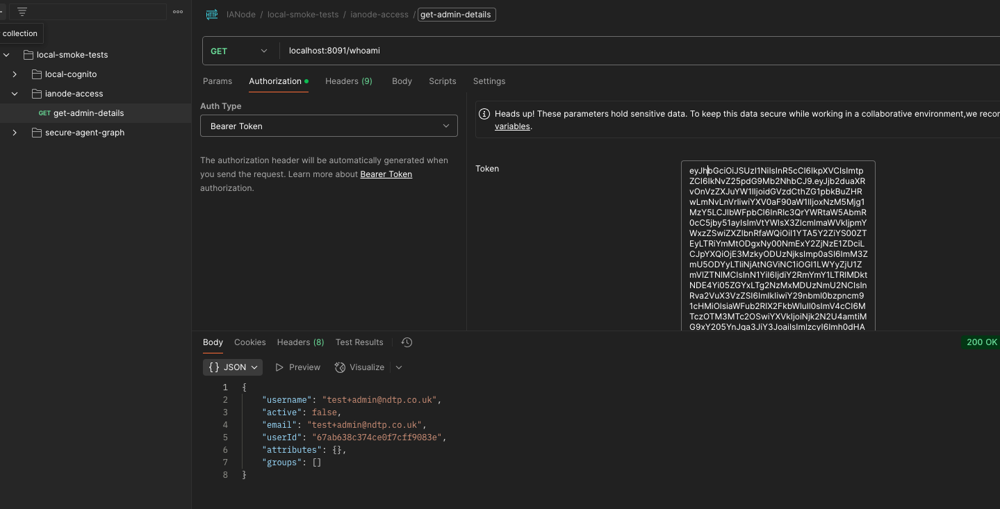
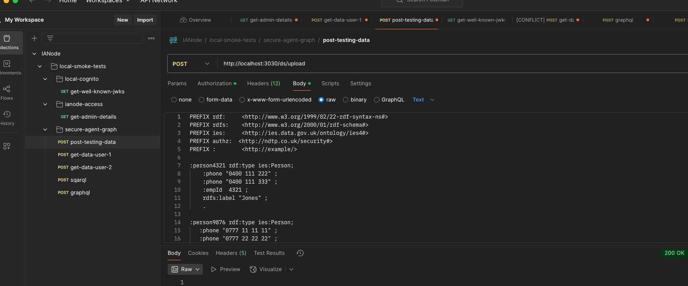
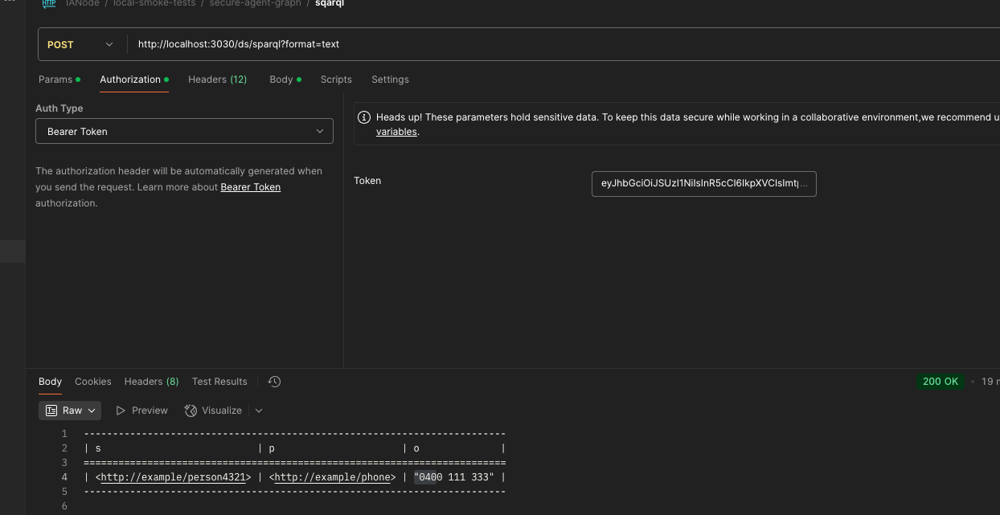
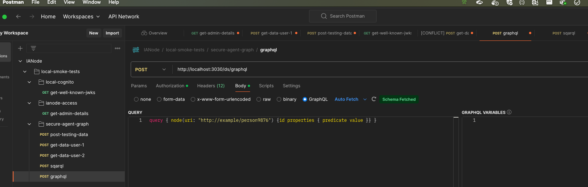

# Local Smoke Tests

## Pre-requisites
Please use [DeploymentLocal.md](../Deployment/DeploymentLocal.md) to set up your local environment

* IANode-access running locally
* Secure Agent Graph installed

## Optional Software
* Postman 

Inside the test_data file you will see a json file called [IANode.json](../../testing/postman/IANode.json), import this into postman which will have all the following requests saved


## IANode Access API

#### Postman
get-admin-details, find this request within Postman and add in your Authorization token from Cognito (local) then hit send


#### Curl
Please see towards the end of the [start-up and identity](../Deployment/DeploymentLocal.md#start-up-identity-provider-and-access-control) section for the curl command instructions

### Secure Agent Graph
Testing data already exists within Secure Agent Graph, please refer to [Start up Secure Agent Graph](../Deployment/DeploymentLocal.md#start-up-secure-agent-graph) to get this installed

Use the instructions found within [Run access control test](../Deployment/DeploymentLocal.md#run-access-control-test) in the DeploymentLocal.md to start the instance

The following test users have been added to the attribute-store.ttl
* test+user+admin@ndtp.co.uk
* test+user@ndtp.co.uk

Run the Cognito local commands to pull back the tokens for both users and make a note of both tokens
```
aws --endpoint http://0.0.0.0:9229 cognito-idp initiate-auth --client-id 6967e8jkb0oqcm9brjkrbcrhj --auth-flow USER_PASSWORD_AUTH --auth-parameters USERNAME=test+user+admin@ndtp.co.uk,PASSWORD=password
aws --endpoint http://0.0.0.0:9229 cognito-idp initiate-auth --client-id 6967e8jkb0oqcm9brjkrbcrhj --auth-flow USER_PASSWORD_AUTH --auth-parameters USERNAME=test+user@ndtp.co.uk,PASSWORD=password

```

#### Curl Testing commands
For testing via curl, these commands can be found within  [Run access control test](../Deployment/DeploymentLocal.md#run-access-control-test) section of the DeploymentLocal.md file, please use those commands for testing via curl

#### Postman
The following are the same tests as the Curl commands listed above, just using Postman

######  Load test data
In Postman, under secure-agent-graph, click on the post-testing-data request, under the Authorization tab you will need to add the token of one of the 2 users above.


Inside the body tab you can see the testing data that's passed to the server, now press Send.

Once a 200 reponse has been received, tests can be run against your local Secure Agent Graph server.

###### Sqarql
Add a Authorisation Token for one of the users above and hit send 


Now do the same thing for the second user, you should see slightly different results as both users have been given different roles within the test setup



###### Query
get-data-user-1 set-up to pull back query data, set the Authorisation Token within the Authorisation tab and hit send.
get-data-user-2 is the same request, this way you can add the Authorisation Token for the second user here without affecting the results in get-data-user-1

###### Graphql
For Graphql, to change which users get pulled back from the testing data, manually edit the graphql request
currently its pulling back data for person9876, change that to person4321 and resent to get back different data


