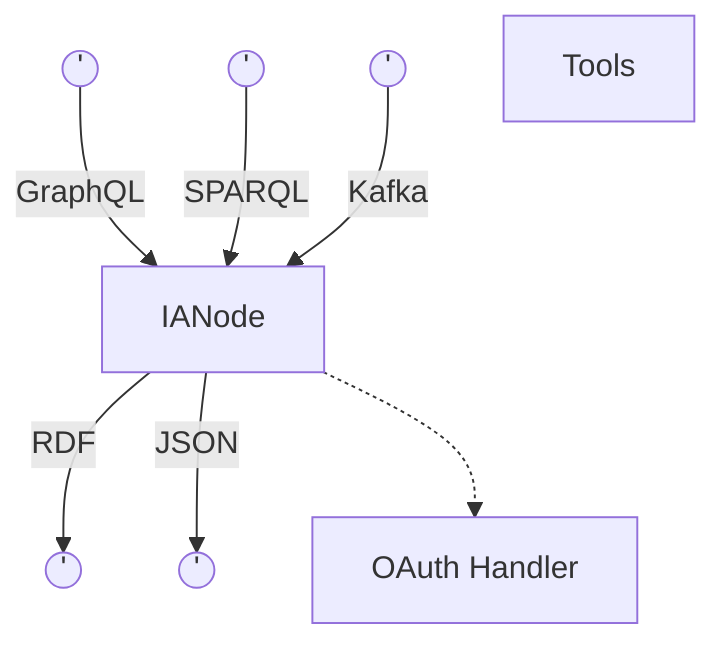
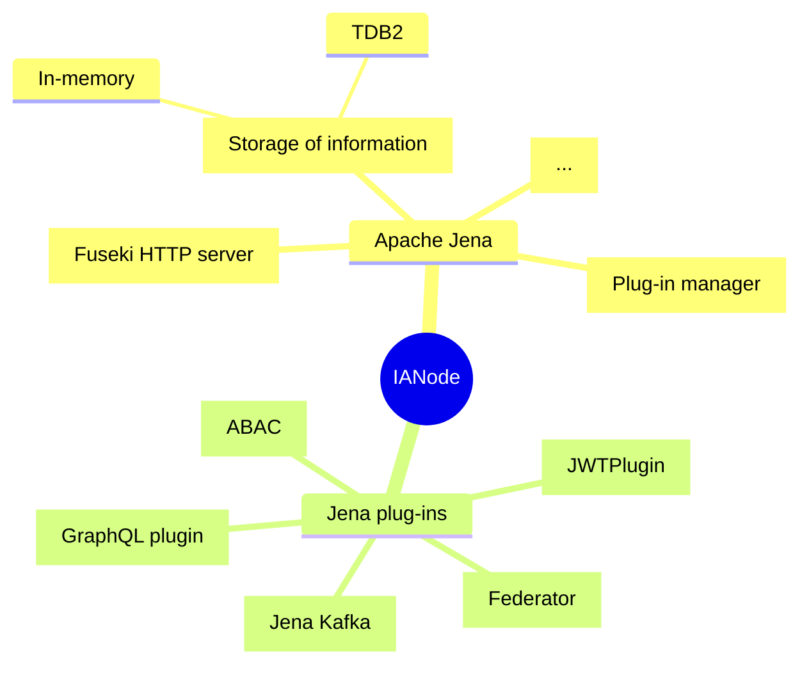
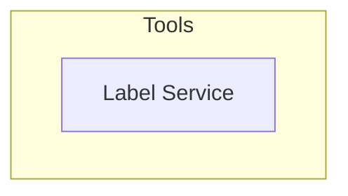

# Overview of an IA Node

An IA Node accepts SPARQL and GraphQL queries as well as actions and data via Kafka. The IANode provides Json in response to GraphQL queries and RDF for SPARQL queries. It integrates with an OAuth handler to provide fine-grained access control to information in the IA Node or connected IA Nodes. It also stores the data and supports sharing of data with other IA Nodes.

The following links list out the main levels and features of IA Node
* [Levels of an IA Node](IntegrationArchitecture.md)
* [Features of an IA Node](Features.md)

## Key Functional components of an IA Node

An IA Node comprises many components built on top of Apache Jena.

## Detailed working of an IA Node

* [IA Node in Action](InAction.md)

