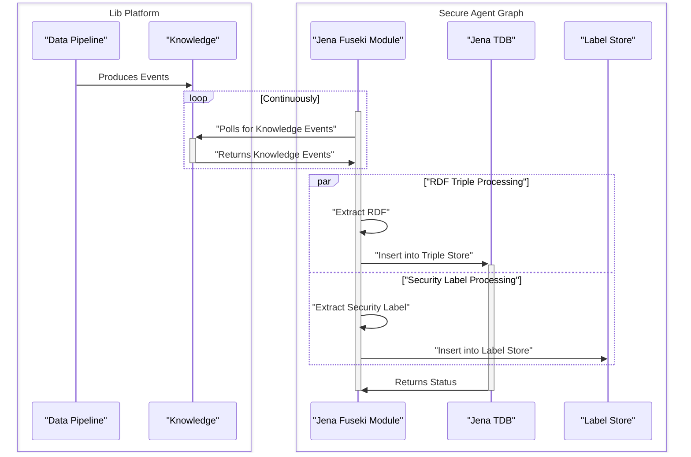
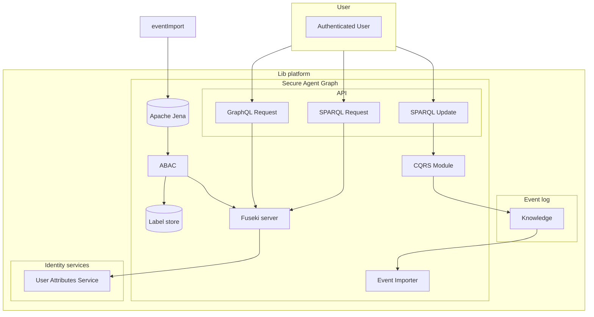

# IA Node in action
**Repository:** integration-architecture-documentation 

**Description:** This file contains documentation about data ingestion sequence and logical data flow of Integration Architecture Node (IA Node). 

<!-- SPDX-License-Identifier: OGL-UK-3.0 -->

## Data ingest pipeline sequence

## Logical flow

© Crown Copyright 2025. This work has been developed by the National Digital Twin Programme and is legally attributed to the Department for Business and Trade (UK) as the governing entity.  
Licensed under the Open Government Licence v3.0.  

You can view the full license at:  
https://www.nationalarchives.gov.uk/doc/open-government-licence/version/3/
