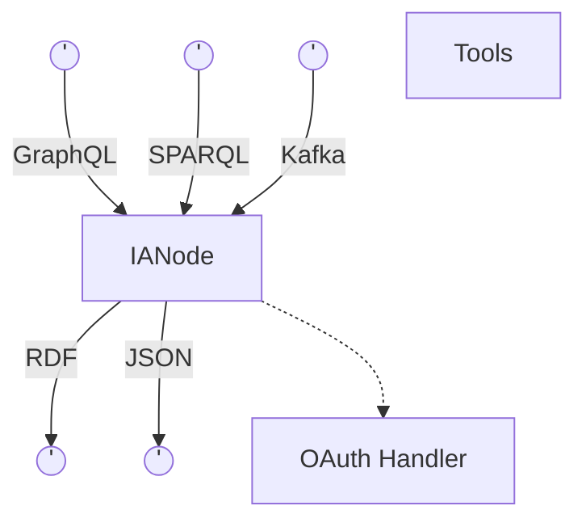
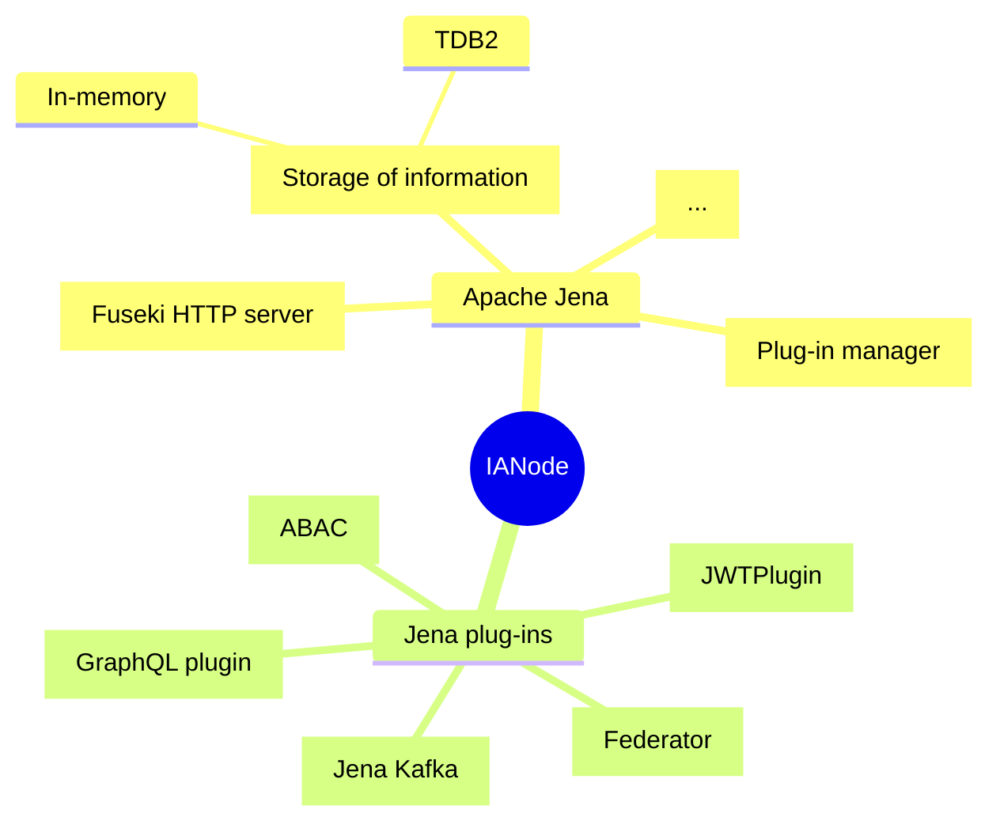
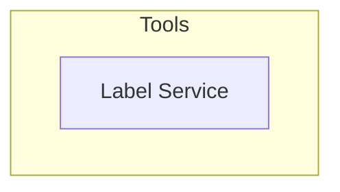

# Key Functional Components

**Repository:** `integration-architecture-documentation`  
**Description:** `This file provides documentation on Integration Architecture Node (IA Node) key functional components. `  
<!-- SPDX-License-Identifier: OGL-UK-3.0 -->

IA Node accepts SPARQL and GraphQL queries as well as actions and data via Kafka. It provides a Json response to GraphQL queries and RDF for SPARQL queries. IA Node also integrates with an OAuth handler to provide fine-grained access control to information within it or connected IA nodes. Additionally, IA Node stores data and supports sharing of data with other IA Nodes.

You can learn more about the levels and features of IA Node in:
* [Levels of an IA Node](../integration-architecture.md#integration-architecture-levels)
* [Features of an IA Node](features.md)

## Key Functional components of an IA Node

IA Node comprises several components built on top of Apache Jena.

## Detailed working of an IA Node

* [IA Node in Action](in-action.md)

© Crown Copyright 2025. This work has been developed by the National Digital Twin Programme and is legally attributed to the Department for Business and Trade (UK) as the governing entity.  
Licensed under the Open Government Licence v3.0.  

You can view the full license at:  
https://www.nationalarchives.gov.uk/doc/open-government-licence/version/3/
