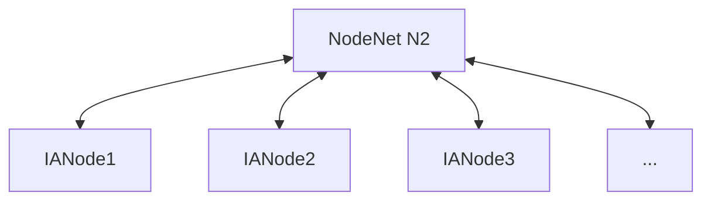

# Node Net
**Repository:** integration-architecture-documentation 

**Description:** This file contains documentation about Integration Architecture Node Net (IA Node Net). 

<!-- SPDX-License-Identifier: OGL-UK-3.0 -->

## Outlines the concept and composition of a Node Network (Node Net). 
A Node Net is a network composed of multiple [IA nodes](IANode/ia-node.md) (and typically a Management Node) working together. It is a network that can be deployed by any organisation or consortium to address specific digital twin or data needs or services. The Management Node within a Node net handles its lifecycle tasks and ensures alignment with both local and national requirements.

Also known as N2.

© Crown Copyright 2025. This work has been developed by the National Digital Twin Programme and is legally attributed to the Department for Business and Trade (UK) as the governing entity.  
Licensed under the Open Government Licence v3.0.  

You can view the full license at:  
https://www.nationalarchives.gov.uk/doc/open-government-licence/version/3/
