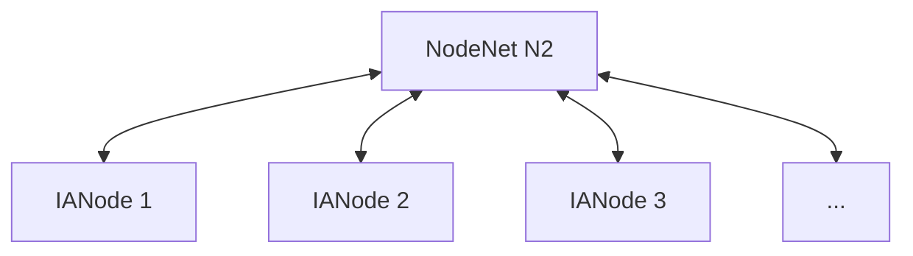

# NodeNet
A NodeNet is a network composed of multiple [IANode](IANode/IANode.md)s (and typically a ManagementNode) working together. A NodeNet can be deployed by any organisation or consortium to address specific digital twin or data needs or services. The ManagementNode within a NodeNet handles its lifecycle tasks and ensures alignment with both local and national requirements.

Also known as N2.

